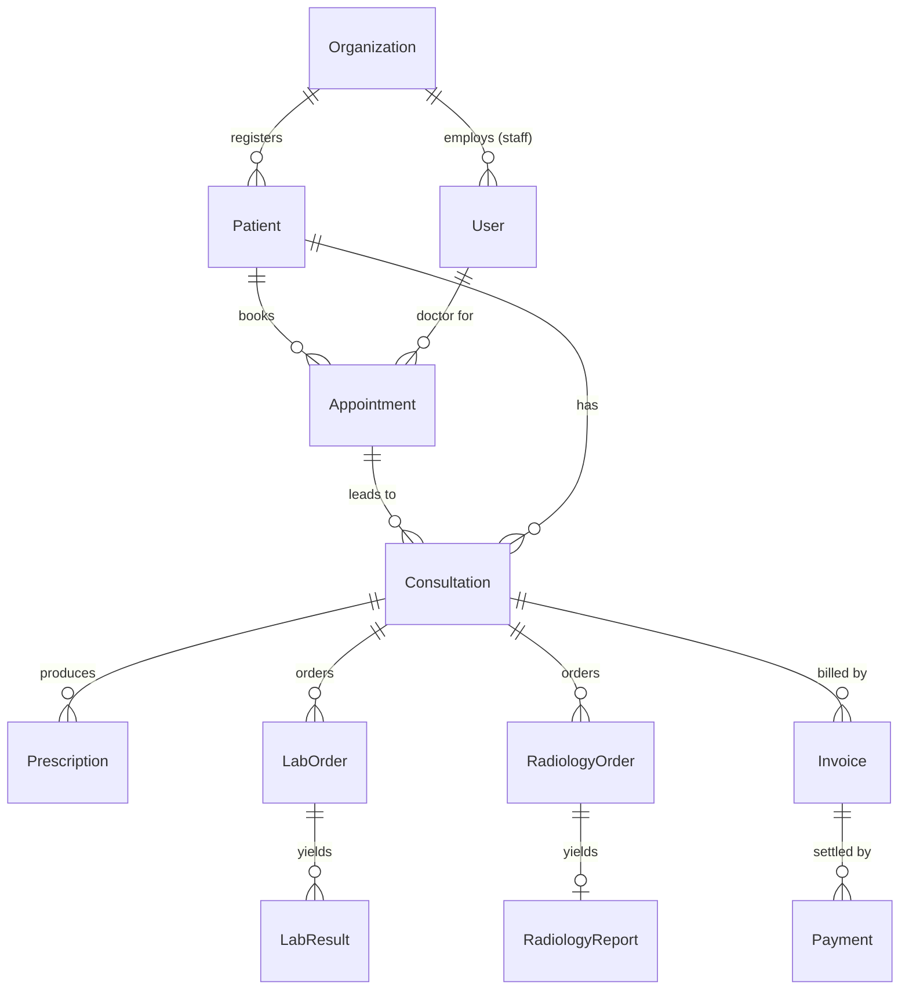

# Database ER Diagram

Auto-derived from `schema.prisma`. Render this on GitHub, in VS Code (Mermaid
preview extension), or by pasting into <https://mermaid.live>.

`||--o{` means **one-to-many** (one parent row → many child rows).
Most tables hang off **Organization** (multi-hospital tenancy) and **Patient**.

---

## 1. Core clinical flow (the everyday journey)

This is the simplified "patient journey" view — easiest to read first.

---

## 2. Full schema (all tables & foreign keys)

```mermaid
erDiagram
    %% ---------- CORE ----------
    Organization ||--o{ User : ""
    Organization ||--o{ Department : ""
    Organization ||--o{ Patient : ""
    Department   ||--o{ User : ""

    %% ---------- FRONT DESK / TRIAGE ----------
    Organization ||--o{ PreTriage : ""
    Patient      ||--o{ PreTriage : ""
    Organization ||--o{ QueueManagement : ""
    Patient      ||--o{ QueueManagement : ""
    Organization ||--o{ TriageAssessment : ""
    Patient      ||--o{ TriageAssessment : ""

    %% ---------- APPOINTMENTS / CONSULTATIONS ----------
    Organization ||--o{ Appointment : ""
    Patient      ||--o{ Appointment : ""
    User         ||--o{ Appointment : "doctor"
    Organization ||--o{ Consultation : ""
    Patient      ||--o{ Consultation : ""
    User         ||--o{ Consultation : "doctor"
    Appointment  ||--o{ Consultation : ""

    %% ---------- INPATIENT ----------
    Organization ||--o{ Ward : ""
    Department   ||--o{ Ward : ""
    Organization ||--o{ Bed : ""
    Ward         ||--o{ Bed : ""
    Organization ||--o{ Admission : ""
    Patient      ||--o{ Admission : ""
    Bed          ||--o{ Admission : ""

    %% ---------- DEATH CERTIFICATES ----------
    Organization ||--o{ DeathCertificate : ""
    Patient      ||--o{ DeathCertificate : ""

    %% ---------- PHARMACY ----------
    Organization ||--o{ PharmacyDrug : ""
    PharmacyDrug ||--o{ PharmacyBatch : ""
    Organization ||--o{ Prescription : ""
    Patient      ||--o{ Prescription : ""
    Consultation ||--o{ Prescription : ""
    Organization ||--o{ PharmacySale : ""
    Patient      ||--o{ PharmacySale : ""
    Prescription ||--o{ PharmacySale : ""
    Organization ||--o{ PharmacyPurchaseOrder : ""

    %% ---------- LABORATORY ----------
    Organization ||--o{ LabTest : ""
    Organization ||--o{ LabOrder : ""
    Patient      ||--o{ LabOrder : ""
    Consultation ||--o{ LabOrder : ""
    LabOrder     ||--o{ LabResult : ""
    LabTest      ||--o{ LabResult : ""

    %% ---------- RADIOLOGY ----------
    Organization  ||--o{ RadiologyExam : ""
    Organization  ||--o{ RadiologyOrder : ""
    Patient       ||--o{ RadiologyOrder : ""
    Consultation  ||--o{ RadiologyOrder : ""
    RadiologyExam ||--o{ RadiologyOrder : ""
    RadiologyOrder ||--o| RadiologyReport : ""

    %% ---------- BILLING ----------
    Organization ||--o{ BillingService : ""
    Organization ||--o{ Invoice : ""
    Patient      ||--o{ Invoice : ""
    Consultation ||--o{ Invoice : ""
    Organization ||--o{ Payment : ""
    Invoice      ||--o{ Payment : ""
    Patient      ||--o{ Payment : ""

    %% ---------- DOCTOR ACCOUNTABILITY ----------
    Organization ||--o{ DoctorCommissionConfig : ""
    User         ||--o| DoctorCommissionConfig : ""
    Organization ||--o{ DoctorCommission : ""
    User         ||--o{ DoctorCommission : ""

    %% ---------- MACHINE INTEGRATION ----------
    Organization       ||--o{ MachineIntegration : ""
    Organization       ||--o{ MachineResultsQueue : ""
    MachineIntegration ||--o{ MachineResultsQueue : ""
    Patient            ||--o{ MachineResultsQueue : ""
    MachineIntegration ||--o{ IntegrationLog : ""

    %% ---------- ADMIN / SYSTEM ----------
    Organization ||--o{ UserInvitation : ""
    User         ||--o{ UserInvitation : ""
    User         ||--o{ UserActivity : ""
    Permission   ||--o{ RolePermission : ""
    Organization ||--o{ AuditLog : ""
    User         ||--o{ AuditLog : ""
    Organization ||--o{ Notification : ""
    User         ||--o{ Notification : ""

    %% ---------- eAPTS ----------
    Organization ||--o| EaptsConfig : ""
    Organization ||--o{ EaptsMedicationMapping : ""
    PharmacyDrug ||--o{ EaptsMedicationMapping : ""
    Organization ||--o{ EaptsTransaction : ""
```

---

## How to read it

| Symbol | Meaning |
|--------|---------|
| `\|\|--o{` | one-to-many (one parent → zero-or-more children) |
| `\|\|--o\|` | one-to-one optional (e.g. one RadiologyOrder → at most one Report) |

**Two hub tables drive everything:**
- **Organization** — every table links back here (this is your multi-hospital wall).
- **Patient** — the clinical hub; appointments, consultations, orders, bills all point to a patient.

**The money/clinical chain:**
`Appointment → Consultation → (Prescription / LabOrder / RadiologyOrder / Invoice) → (results / Payment)`
